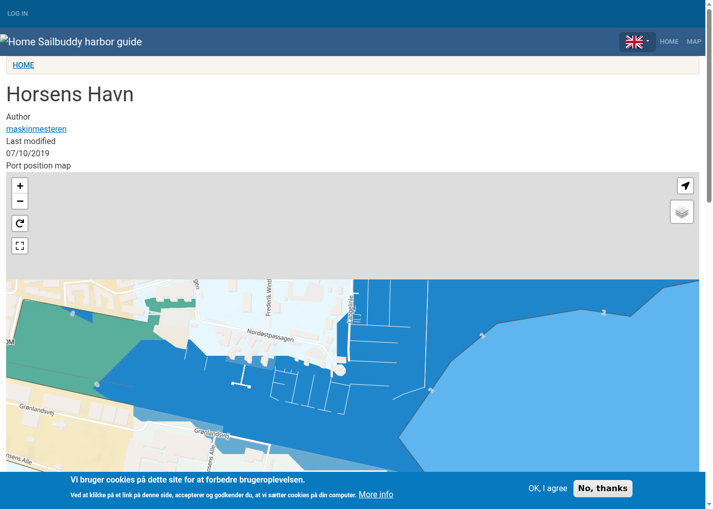

# Sailbuddy OpenMeteo Weather

Drupal 10/11 custom module that shows current weather and a 5-day marine
forecast on harbour / anchorage nodes of the Sailbuddy site, powered by the free
[Open-Meteo Weather](https://open-meteo.com/en/docs) and
[Marine Weather API](https://open-meteo.com/en/docs/marine-weather-api).



## Features

- Current conditions: temperature, wind (speed + compass direction), waves
  (height, period, direction), sea surface temperature, precipitation.
- 5-day forecast: day name (I dag / I morgen / weekday), min/max temperature,
  wind speed + direction, max wave height / period / direction.
- WMO weather codes mapped to Danish descriptions with inline SVG icons.
- Compass arrows generated from degrees (16-point Danish labels).
- Per-coordinate 3-hour cache + page cache, respectful of the free API quota.
- Ships a `harbor_weather_block` block (plugin) to be placed in a region.

## Requirements

- Drupal 10 or 11, `geofield` module installed.
- Nodes of any content type with a geofield called `field_geolocation`
  (a `field_geofield` fallback is also checked).

## Install

```sh
# Copy the module into your site, then:
drush en openmeteo_weather -y
drush cr
```

Place the block **Harbor Weather (Open-Meteo)** (plugin id
`harbor_weather_block`) in the region of your choice. The block renders
nothing on nodes without coordinates / geolocation data.

## Attribution

Weather data is provided by [Open-Meteo](https://open-meteo.com/) (DWD/ECMWF
wave models). Open-Meteo requests attribution to DWD; the widget includes a
visible footer link.

## License

GPL-2.0-or-later